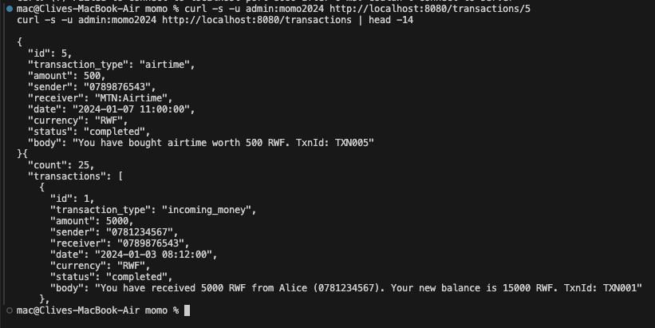
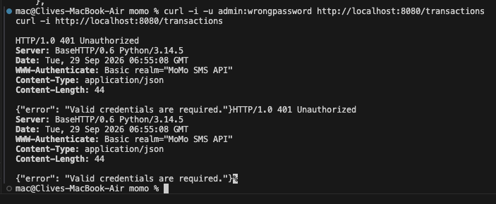
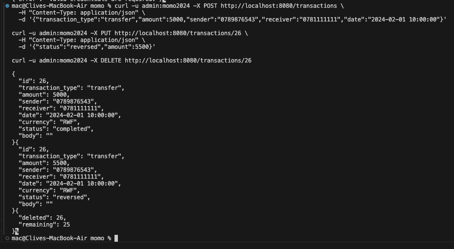
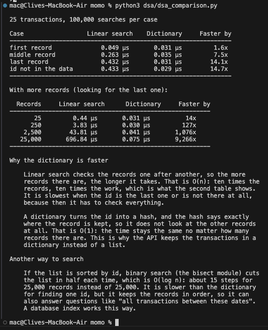

# MoMo SMS REST API: Report

- **Project:** MoMo SMS Ledger
- **Author:** Clive Mushipe
- **API:** Python `http.server` with HTTP Basic Authentication
- **Files:** `api/api.py`, `dsa/parse_sms.py`, `dsa/dsa_comparison.py`, `docs/api_docs.md`, `screenshots/`

---

## 1. Introduction to API security

An API opens up data that was private before. The records in this project are somebody's money: who paid them, who they paid, how much and when. Anyone who can call `GET /transactions` can read all of it, and anyone who can call `DELETE` can destroy it. So the first question is not what an endpoint returns, but who is allowed to ask.

Three things matter for an API like this one.

**Authentication** is knowing who is calling. This API uses HTTP Basic Authentication: the client sends a username and password in an `Authorization` header with every request, and the server checks them before doing anything else. If they are missing or wrong, the answer is `401 Unauthorized` and nothing else happens.

**Encryption in transit** keeps anyone in between from reading the traffic. Basic Auth does not provide this by itself; it depends on HTTPS. This API runs on plain HTTP, so the credentials could be read by someone watching the network. That is acceptable for a demo on my own machine, and not acceptable anywhere else.

**Input validation** stops bad data getting in through the front door. Every request body is checked before it is stored: `amount` has to be a whole number above zero, and `transaction_type` has to be one of the four kinds in the data. Anything else is refused with `400` and a message saying what was wrong.

The errors matter as much as the successes. A request with no password gets `401` rather than an empty list, a transaction that does not exist gets `404`, and a bad body gets `400` with the reason. An API that answers vaguely is hard to use, and code that is hard to use ends up being used badly.

---

## 2. The endpoints

Base URL `http://localhost:8080`. Every endpoint needs the username `admin` and the password `momo2024`. Full examples are in [`api_docs.md`](api_docs.md).

| Method | Path | What it does | Success | Errors |
|--------|------|--------------|---------|--------|
| GET | `/transactions` | List all 25 transactions | 200 | 401 |
| GET | `/transactions/{id}` | One transaction | 200 | 401, 404 |
| POST | `/transactions` | Add one | 201 | 400, 401 |
| PUT | `/transactions/{id}` | Change one | 200 | 400, 401, 404 |
| DELETE | `/transactions/{id}` | Delete one | 200 | 401, 404 |

The records come from `data/modified_sms_v2.xml`. `dsa/parse_sms.py` reads the file and turns each `<sms>` element into a dictionary with `id`, `transaction_type`, `amount`, `sender`, `receiver`, `date`, `currency`, `status` and `body`. They are kept in memory while the server runs.

### Test evidence

A GET with the right username and password:

A wrong password, then no credentials at all. Both give `401`:

Adding, changing and deleting a transaction:

There are also 10 automated tests in `tests/test_plain_api.py` covering the same cases, and they run on every push through GitHub Actions.

---

## 3. Linear search against dictionary lookup

Both ways answer the same question: find the transaction with a given id, out of the 25 records. Each case was run 100,000 times and the average taken.

| Case | Linear search | Dictionary lookup | Faster by |
|---|---|---|---|
| First record | 0.049 µs | 0.031 µs | 1.6× |
| Middle record | 0.263 µs | 0.035 µs | 7.5× |
| Last record | 0.432 µs | 0.031 µs | 14.1× |
| Id not in the data | 0.433 µs | 0.029 µs | 14.7× |

The pattern is what matters. The list is quick when the record is near the front and slowest when the record is last or missing, because then it has to check all 25. The dictionary takes the same time in every case, including when the answer is "not there".

The difference grows with the amount of data. Here the same records are copied with new ids, and the last one is looked up:

| Records | Linear search | Dictionary lookup | Faster by |
|---|---|---|---|
| 25 | 0.44 µs | 0.031 µs | 14× |
| 250 | 3.83 µs | 0.030 µs | 127× |
| 2,500 | 43.81 µs | 0.041 µs | 1,076× |
| 25,000 | 696.84 µs | 0.075 µs | 9,266× |

### Why the dictionary is faster

Linear search checks the records one after another, so the work grows with the number of records. That is O(n), and the table follows it closely: ten times the records means roughly ten times the time (0.44 → 3.83 → 43.81 → 696.84 µs). The last step grew a bit more than tenfold, because by 25,000 records the list no longer fits in the processor's fast cache.

A dictionary turns the id into a hash, and the hash says where the record is kept, so it never looks at the other records. That is O(1), and the time stayed between 0.029 and 0.075 µs even with a thousand times more data.

This is why the API keeps its transactions in a dictionary keyed by id. `GET /transactions/5` is one hash, and it would still be one hash with a million records.

### Another way to search

If the records are sorted by id, binary search (Python's `bisect` module) cuts the list in half each time until it finds the id. That is O(log n): about 15 steps for 25,000 records instead of 25,000 comparisons. It is slower than a dictionary for finding one id, but the records stay in order, so it can also answer questions like "every transaction in January", which a dictionary cannot. This is how a database index works, and the MySQL side of this project uses one on the user and date columns.

A dictionary only helps when searching by id. Searching by sender or by amount still goes through everything, and would need its own index to be fast.

---

## 4. Reflection on Basic Auth

Basic Auth is easy: one header, no login endpoint, no tokens to keep track of, and every client already supports it. That is why it suits this assignment. It also has real limits.

**The password goes out with every request.** Base64 is an encoding, not encryption, so `YWRtaW46bW9tbzIwMjQ=` becomes `admin:momo2024` again with one command. Without HTTPS, anyone on the same network can read it, and the thing they get is the password itself, not a temporary token.

**It never expires.** The password works until somebody changes it, and changing it breaks every client at the same time. There is no way to sign out a single client.

**There is only one account.** Whoever logs in can read, add, change and delete. Something that only needs to read the data still gets permission to delete it.

**The password sits in the code.** `api/api.py` contains `admin` and `momo2024`, so anyone who reads the repository knows them. A real system would store a hash of the password, as the dashboard app in `app/` does with bcrypt, and keep it out of the source code.

**Nothing slows down guessing.** Someone can try passwords as fast as the server answers, and this API does nothing about it.

### What I would use instead

**JWT** would be the next step for this project. The client logs in once, gets back a signed token with an expiry time, and sends that token instead of the password. The token stops working on its own, and it can say what the user is allowed to do. The dashboard app already works in a similar way, with bcrypt hashes and a random session token in a cookie instead of the password.

**OAuth 2.0** would suit an API that other people's applications connect to. The password never reaches this API; a separate server handles login and hands out tokens with limited permissions, and access can be taken away from one app without changing anything else. It is a lot more work to set up, which is why it belongs where outside apps are involved.

**HTTPS comes first either way.** Without it, tokens are just as easy to read in transit as a password, so encryption is the thing to add before anything else.

---

## 5. Conclusion

The API does what the assignment asked: five CRUD endpoints on `http.server`, all of them behind Basic Authentication, answering `401` for wrong or missing credentials, `400` for bad input and `404` for records that are not there. The XML is parsed into JSON objects that keep every field, including sender and receiver. The search comparison shows the dictionary beating the list by about 14× at 25 records and over 9,000× at 25,000, for the reason the theory gives. Basic Auth is the part I would change first if this were going anywhere real.
