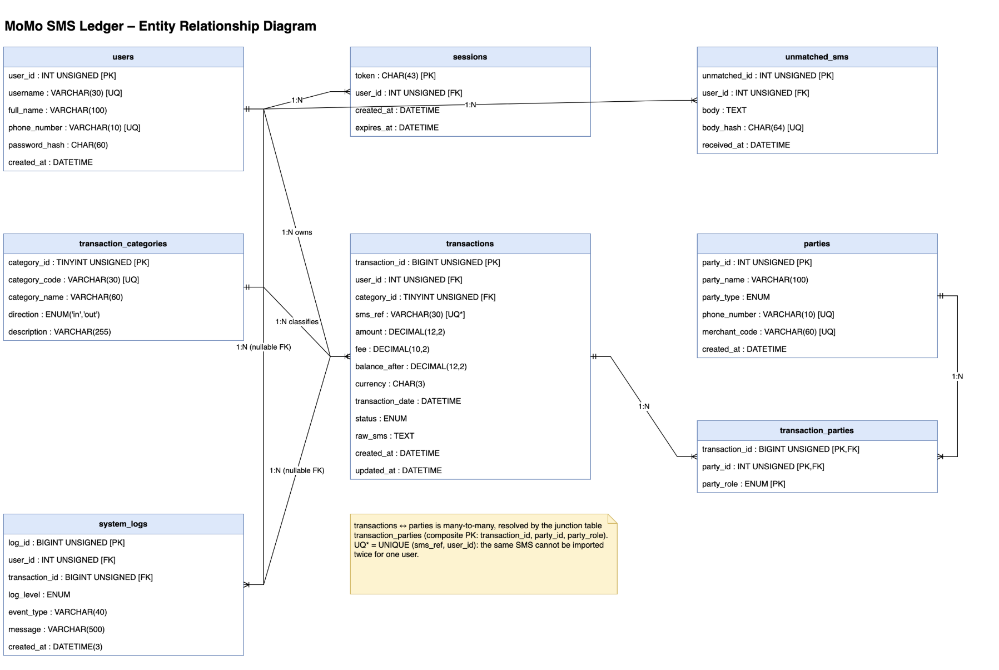
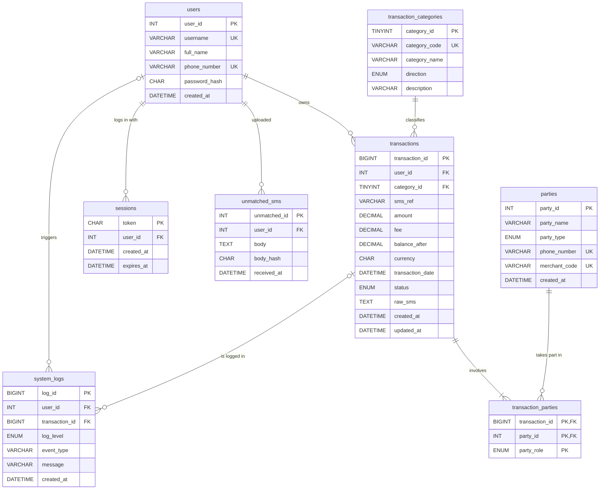
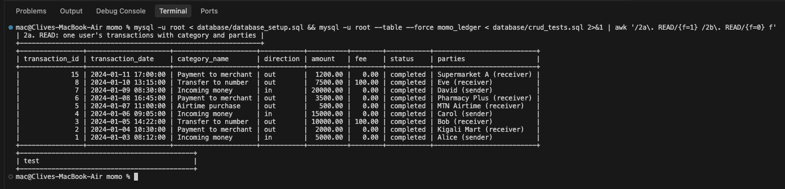
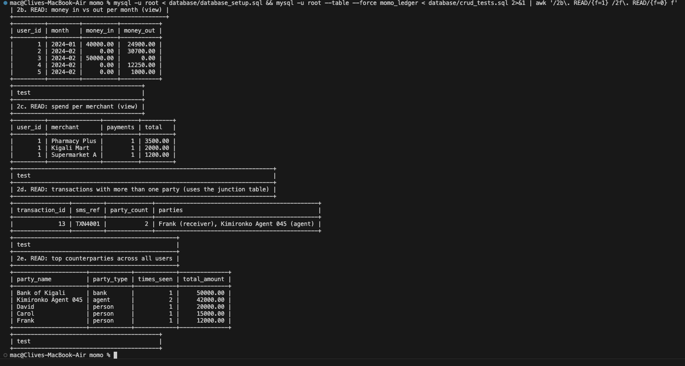
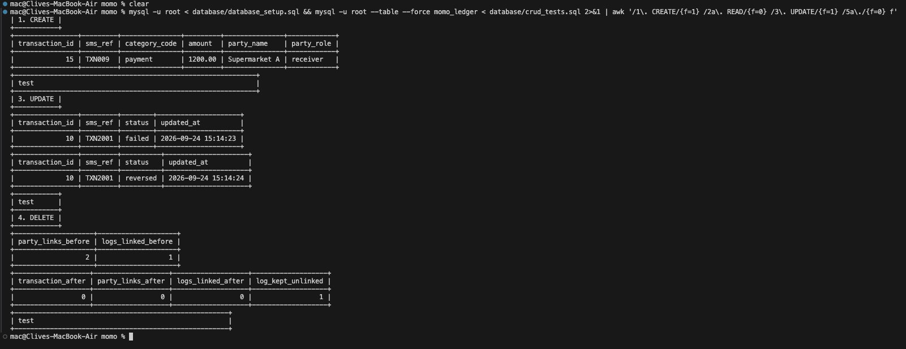
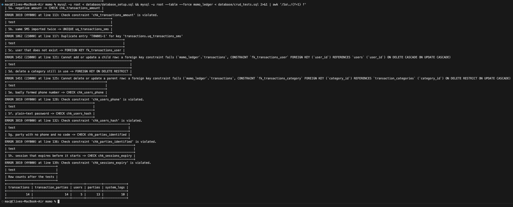

# MoMo Ledger: Database Design Document

- **Project:** MoMo SMS Ledger
- **Author:** Clive Mushipe
- **Database:** MySQL 8.0+ (tested on MySQL 9.7.1)
- **Files:** `database/database_setup.sql`, `database/crud_tests.sql`, `database/crud_test_results.txt`, `examples/json_schemas.json`, `docs/erd.drawio`, `docs/erd.dbml`

---

## 1. Introduction

MoMo Ledger turns MTN Mobile Money SMS messages into a ledger that a user can search, edit and chart. A user uploads an XML backup of their phone's messages; the app reads each MoMo message, works out what kind of transaction it is, how much moved and who was on the other side, and stores it.

This document describes the relational database behind that: the ERD, why I designed it this way, a data dictionary, sample queries with their real output, the CRUD tests I ran, the security rules, and how the tables map to the JSON the API returns.

---

## 2. Entity Relationship Diagram



*Drawn in Draw.io. The editable source is [`erd.drawio`](erd.drawio), and [`erd.dbml`](erd.dbml) holds the same model in dbdiagram.io format.*

The same diagram in text form (GitHub renders this):



### Relationships and cardinality

| Relationship | Cardinality | How it is enforced |
|---|---|---|
| users → transactions | 1 : N (a user has zero or more transactions; each transaction has exactly one owner) | `transactions.user_id` NOT NULL FK, `ON DELETE CASCADE` |
| transaction_categories → transactions | 1 : N (each transaction has exactly one category) | `transactions.category_id` NOT NULL FK, `ON DELETE RESTRICT` |
| transactions ↔ parties | **M : N**, resolved by `transaction_parties` | Composite PK `(transaction_id, party_id, party_role)`, two FKs |
| users → sessions | 1 : N | `sessions.user_id` NOT NULL FK, `ON DELETE CASCADE` |
| users → unmatched_sms | 1 : N | `unmatched_sms.user_id` NOT NULL FK, `ON DELETE CASCADE` |
| users → system_logs | 0..1 : N (a log may have no user, e.g. a failed login for an unknown name) | nullable FK, `ON DELETE SET NULL` |
| transactions → system_logs | 0..1 : N | nullable FK, `ON DELETE SET NULL` |

### From the XML to the tables

The design comes from the MoMo SMS export in `data/`. Each `<sms>` element carries these attributes:

| XML | Example | Where it goes |
|---|---|---|
| `transaction_type` | `payment` | `transaction_categories.category_code`, referenced by `transactions.category_id` |
| `amount` | `2000` | `transactions.amount` |
| `currency` | `RWF` | `transactions.currency` |
| `date` | `2024-01-04 10:30:00` | `transactions.transaction_date` |
| `status` | `completed` | `transactions.status` |
| `sender` | `0781234567` | `parties` (matched on `phone_number`), linked by `transaction_parties` with role `sender` |
| `receiver` | `MTN:MoMoPay:Kigali_Mart` | `parties` (matched on `merchant_code`), linked by `transaction_parties` with role `receiver` |
| `body` | `Your payment of 2000 RWF to Kigali Mart was successful. TxnId: TXN002` | `transactions.raw_sms`; the `TxnId` inside it becomes `transactions.sms_ref` |

A real phone backup has only `body` and `date`, so the parser reads the rest out of the message text. Any MoMo message no rule understands is kept in `unmatched_sms` instead of being dropped, and the import itself is recorded in `system_logs`.

---

## 3. Design rationale

Every SMS describes one movement of money in one person's wallet, so **transactions** is the central table and everything else hangs off it. A transaction belongs to exactly one **user**, the wallet owner who uploaded the backup, so that is 1:N with a NOT NULL foreign key and `ON DELETE CASCADE`: a ledger with no owner means nothing.

The kind of transaction lives in a **transaction_categories** lookup table rather than a free-text column. That stops typos ("payement"), lets a category such as bank deposits be added without changing code, and records the `direction` (in or out) once, which the monthly totals rely on. Its foreign key uses `ON DELETE RESTRICT`, so a category still in use cannot be deleted.

The other side of a transaction is its own entity, **parties**: people, merchants, agents, banks and MTN services. As plain text, "Kigali Mart" and "Kigali mart" would be two merchants, and nothing could total what one person had been paid. A party appears in many transactions, and a transaction can involve more than one party, because a transfer made at an agent has both a receiver and an agent. That many-to-many relationship is resolved by the junction table **transaction_parties**, whose composite primary key includes `party_role`, so a party cannot be linked twice in the same role.

**system_logs** records imports, failed logins and errors. Its foreign keys are nullable and use `ON DELETE SET NULL`, because a log must outlive the rows it mentions.

Money is `DECIMAL(12,2)`, since floating point cannot hold amounts exactly; `ENUM` covers small fixed sets, and `CHAR` the fixed lengths (a bcrypt hash is 60 characters, a session token 43). `UNIQUE (sms_ref, user_id)` means the same SMS is never counted twice, and CHECK constraints reject impossible values in the database itself, not only in the app.

---

## 4. Data dictionary

Abbreviations: **PK** primary key, **FK** foreign key, **UQ** unique, **NN** not null.

### users: wallet owners who use the ledger

| Column | Type | Keys / constraints | Description |
|---|---|---|---|
| user_id | INT UNSIGNED | PK, auto-increment | Identifier |
| username | VARCHAR(30) | UQ, NN, CHECK `^[A-Za-z0-9_]{3,30}$` | Login name |
| full_name | VARCHAR(100) | NN | Name shown on the dashboard |
| phone_number | VARCHAR(10) | UQ, NN, CHECK `^07[2389][0-9]{7}$` | MTN number the SMS backups come from |
| password_hash | CHAR(60) | NN, CHECK bcrypt format and length 60 | bcrypt hash; the password is never stored |
| created_at | DATETIME | NN, default now | When the account was created |

### transaction_categories: kinds of transaction

| Column | Type | Keys / constraints | Description |
|---|---|---|---|
| category_id | TINYINT UNSIGNED | PK, auto-increment | Identifier |
| category_code | VARCHAR(30) | UQ, NN, CHECK `^[a-z_]+$` | Stable code used by the parser and API |
| category_name | VARCHAR(60) | NN | Human-readable name |
| direction | ENUM('in','out') | NN | Whether money enters or leaves the wallet |
| description | VARCHAR(255) | nullable | Which SMS fall in this category |

### transactions: one row per MoMo transaction

| Column | Type | Keys / constraints | Description |
|---|---|---|---|
| transaction_id | BIGINT UNSIGNED | PK, auto-increment | Identifier |
| user_id | INT UNSIGNED | FK → users, NN, CASCADE | Wallet owner |
| category_id | TINYINT UNSIGNED | FK → transaction_categories, NN, RESTRICT | Kind of transaction |
| sms_ref | VARCHAR(30) | nullable; UQ with user_id | TxnId from the SMS; NULL for manual entries |
| amount | DECIMAL(12,2) | NN, CHECK > 0 | Amount moved |
| fee | DECIMAL(10,2) | NN, default 0, CHECK ≥ 0 | MTN fee |
| balance_after | DECIMAL(12,2) | nullable, CHECK ≥ 0 | Balance after, only when the SMS states it |
| currency | CHAR(3) | NN, default 'RWF', CHECK `^[A-Z]{3}$` | ISO 4217 code |
| transaction_date | DATETIME | NN | When it happened |
| status | ENUM('completed','pending','failed','reversed') | NN, default 'completed' | Outcome |
| raw_sms | TEXT | nullable | Original message, so it can be parsed again |
| created_at | DATETIME | NN, default now | Row inserted |
| updated_at | DATETIME | NN, auto-updates | Row last changed |

Indexes: `idx_transactions_user_date (user_id, transaction_date)`, `uq_transactions_sms (sms_ref, user_id)`, `idx_transactions_category`, `idx_transactions_status`.

### parties: the other side of a transaction

| Column | Type | Keys / constraints | Description |
|---|---|---|---|
| party_id | INT UNSIGNED | PK, auto-increment | Identifier |
| party_name | VARCHAR(100) | NN, indexed | Name as it appears in the SMS |
| party_type | ENUM('person','merchant','agent','bank','service') | NN | Kind of party |
| phone_number | VARCHAR(10) | UQ, nullable, CHECK phone format | For people and agents |
| merchant_code | VARCHAR(60) | UQ, nullable | MoMoPay or service code |
| created_at | DATETIME | NN, default now | First seen |

Table CHECK `chk_parties_identified`: at least one of `phone_number` and `merchant_code` must be set.

### transaction_parties: junction table (transactions M:N parties)

| Column | Type | Keys / constraints | Description |
|---|---|---|---|
| transaction_id | BIGINT UNSIGNED | PK part, FK → transactions, CASCADE | The transaction |
| party_id | INT UNSIGNED | PK part, FK → parties, RESTRICT, indexed | The party |
| party_role | ENUM('sender','receiver','agent') | PK part | Role in this transaction |

### system_logs: processing and audit log

| Column | Type | Keys / constraints | Description |
|---|---|---|---|
| log_id | BIGINT UNSIGNED | PK, auto-increment | Identifier |
| user_id | INT UNSIGNED | FK → users, nullable, SET NULL | User involved, if known |
| transaction_id | BIGINT UNSIGNED | FK → transactions, nullable, SET NULL | Transaction involved, if any |
| log_level | ENUM('DEBUG','INFO','WARNING','ERROR') | NN, default 'INFO' | Severity |
| event_type | VARCHAR(40) | NN, CHECK `^[a-z_]+$` | Short code, e.g. `sms_import` |
| message | VARCHAR(500) | NN | What happened |
| created_at | DATETIME(3) | NN, default now, indexed | When, to the millisecond |

### sessions: logged-in browsers

| Column | Type | Keys / constraints | Description |
|---|---|---|---|
| token | CHAR(43) | PK | Random URL-safe token (also in an HttpOnly cookie) |
| user_id | INT UNSIGNED | FK → users, NN, CASCADE, indexed | Who is logged in |
| created_at | DATETIME | NN | Login time |
| expires_at | DATETIME | NN, CHECK > created_at | When the token stops working |

### unmatched_sms: MoMo messages the parser could not read

| Column | Type | Keys / constraints | Description |
|---|---|---|---|
| unmatched_id | INT UNSIGNED | PK, auto-increment | Identifier |
| user_id | INT UNSIGNED | FK → users, NN, CASCADE | Whose backup it came from |
| body | TEXT | NN | Full SMS text |
| body_hash | CHAR(64) | NN; UQ with user_id | SHA-256 of body, used to block duplicates |
| received_at | DATETIME | nullable | When the phone received it |

### Views

| View | Purpose |
|---|---|
| v_monthly_flow | Money in and money out (amount + fee) per user per month, completed transactions only |
| v_merchant_spend | Number of payments and total spent at each merchant |

### Sample data loaded

| Table | Rows |
|---|---|
| users | 5 |
| transaction_categories | 6 |
| parties | 13 |
| transactions | 14 |
| transaction_parties | 15 |
| system_logs | 8 |
| sessions | 5 |
| unmatched_sms | 5 |

Transactions 1–8 come from the real sample file `data/modified_sms_v2.xml`.

---

## 5. Sample queries

All results below are real output from `database/crud_tests.sql` (full output in `database/crud_test_results.txt`).

### 5.1 A user's transactions with category and all parties (4-table join)

```sql
SELECT t.transaction_id, t.transaction_date, c.category_name, c.direction,
       t.amount, t.fee, t.status,
       GROUP_CONCAT(CONCAT(p.party_name, ' (', tp.party_role, ')')
                    ORDER BY tp.party_role SEPARATOR ', ') AS parties
FROM transactions t
JOIN transaction_categories c    ON c.category_id = t.category_id
LEFT JOIN transaction_parties tp ON tp.transaction_id = t.transaction_id
LEFT JOIN parties p              ON p.party_id = tp.party_id
WHERE t.user_id = 1
GROUP BY t.transaction_id
ORDER BY t.transaction_date DESC;
```

```
| 15 | 2024-01-11 17:00:00 | Payment to merchant | out |  1200.00 |   0.00 | completed | Supermarket A (receiver) |
|  8 | 2024-01-10 13:15:00 | Transfer to number  | out |  7500.00 | 100.00 | completed | Eve (receiver)           |
|  7 | 2024-01-09 08:30:00 | Incoming money      | in  | 20000.00 |   0.00 | completed | David (sender)           |
...
```



### 5.2 Money in vs out per month (view with a conditional aggregate)

```sql
SELECT * FROM v_monthly_flow ORDER BY user_id, month;
```

```
| user_id | month   | money_in | money_out |
|       1 | 2024-01 | 40000.00 |  24900.00 |
|       2 | 2024-02 |     0.00 |  30700.00 |
|       3 | 2024-02 | 50000.00 |      0.00 |
|       4 | 2024-02 |     0.00 |  12250.00 |
|       5 | 2024-02 |     0.00 |   1000.00 |
```



### 5.3 Transactions with more than one party (uses the M:N junction table)

```sql
SELECT t.transaction_id, t.sms_ref, COUNT(*) AS party_count,
       GROUP_CONCAT(CONCAT(p.party_name, ' (', tp.party_role, ')') SEPARATOR ', ') AS parties
FROM transactions t
JOIN transaction_parties tp ON tp.transaction_id = t.transaction_id
JOIN parties p              ON p.party_id = tp.party_id
GROUP BY t.transaction_id, t.sms_ref
HAVING COUNT(*) > 1;
```

```
| 13 | TXN4001 | 2 | Frank (receiver), Kimironko Agent 045 (agent) |
```

### 5.4 Top counterparties across all users

```sql
SELECT p.party_name, p.party_type, COUNT(*) AS times_seen, SUM(t.amount) AS total_amount
FROM parties p
JOIN transaction_parties tp ON tp.party_id = p.party_id
JOIN transactions t         ON t.transaction_id = tp.transaction_id
WHERE t.status = 'completed'
GROUP BY p.party_id, p.party_name, p.party_type
ORDER BY total_amount DESC
LIMIT 5;
```

```
| Bank of Kigali      | bank   | 1 | 50000.00 |
| Kimironko Agent 045 | agent  | 2 | 42000.00 |
| David               | person | 1 | 20000.00 |
| Carol               | person | 1 | 15000.00 |
| Frank               | person | 1 | 12000.00 |
```

### 5.5 The index is used

```sql
EXPLAIN SELECT transaction_id, amount FROM transactions
WHERE user_id = 1 AND transaction_date BETWEEN '2024-01-01' AND '2024-01-31';
```

```
-> Index range scan on transactions using idx_transactions_user_date
   over (user_id = 1 AND '2024-01-01 00:00:00' <= transaction_date <= '2024-01-31 00:00:00')
```

MySQL reads only the matching slice of `idx_transactions_user_date` instead of scanning the whole table.

---

## 6. CRUD tests

| # | Operation | What I did | Result |
|---|---|---|---|
| 1 | CREATE | Inserted payment TXN009, its party link and a log row inside one `START TRANSACTION … COMMIT` | New row 15 joined to "Supermarket A (receiver)" ✅ |
| 2 | READ | Queries 5.1–5.5 above | Correct rows returned ✅ |
| 3 | UPDATE | Changed TXN2001 from `failed` to `reversed` | Status changed; `updated_at` moved from 13:13:56 to 13:13:57 ✅ |
| 4 | DELETE | Deleted transaction 13 | Its 2 junction rows were removed (CASCADE); its log row was kept with `transaction_id = NULL` (SET NULL) ✅ |

### Constraint tests (each statement must be rejected)

| # | Attempt | MySQL response |
|---|---|---|
| 5a | Amount of −500 | `ERROR 3819: Check constraint 'chk_transactions_amount' is violated` ✅ |
| 5b | Import TXN001 twice | `ERROR 1062: Duplicate entry 'TXN001-1' for key 'uq_transactions_sms'` ✅ |
| 5c | Transaction for user 999 (does not exist) | `ERROR 1452: … foreign key constraint fails (fk_transactions_user)` ✅ |
| 5d | Delete the "payment" category while in use | `ERROR 1451: Cannot delete or update a parent row (fk_transactions_category)` ✅ |
| 5e | Phone number "12345" | `ERROR 3819: Check constraint 'chk_users_phone' is violated` ✅ |
| 5f | Plain-text password | `ERROR 3819: Check constraint 'chk_users_hash' is violated` ✅ |
| 5g | Party with no phone and no code | `ERROR 3819: Check constraint 'chk_parties_identified' is violated` ✅ |
| 5h | Session that expires before it starts | `ERROR 3819: Check constraint 'chk_sessions_expiry' is violated` ✅ |




**A problem I found while testing:** at first I had `UNIQUE (user_id, sms_ref)`. On MySQL 9.7.1, test 5c was *accepted*: a transaction for a user that does not exist was inserted. I narrowed it down to this: when a new row has NULL in a composite UNIQUE key that begins with the foreign-key column, MySQL 9.7.1 did not check that foreign key. Manual entries always have `sms_ref = NULL`, so this would have let orphan rows in. Reordering the key to `UNIQUE (sms_ref, user_id)` keeps the same rule and fixed it; test 5c now fails as it should.

---

## 7. Security rules

1. **Passwords are never stored.** Only bcrypt hashes (cost 12) are saved, and `chk_users_hash` rejects anything that is not a 60-character bcrypt string, so a plain-text password cannot be saved even by mistake.
2. **Every user sees only their own data.** Every query in the app filters on `user_id` from the logged-in session, for example `WHERE id = ? AND user_id = ?`, so guessing another transaction's id returns 404.
3. **No SQL injection.** All values are passed as bound parameters (`?`), never pasted into the SQL string.
4. **Sessions.** Tokens are 32 random bytes (`secrets.token_urlsafe`), stored in an HttpOnly, SameSite=Lax cookie that JavaScript cannot read, and expire after one day (`chk_sessions_expiry`). The cookie's `secure` flag is currently off because the app runs over plain HTTP locally; it must be turned on before deployment over HTTPS.
5. **Least privilege.** The app should connect as a user that can read and write rows but cannot change the schema:

   ```sql
   CREATE USER 'momo_app'@'localhost' IDENTIFIED BY '<strong password from an environment variable>';
   GRANT SELECT, INSERT, UPDATE, DELETE ON momo_ledger.* TO 'momo_app'@'localhost';
   ```

6. **Integrity in the database, not only the app.** Foreign keys, CHECK constraints and UNIQUE keys reject bad data even if it comes from a script or a bug that bypasses the API.
7. **Audit trail survives deletes.** `system_logs` uses `ON DELETE SET NULL`, so deleting a user or transaction does not erase the record of what happened.
8. **Sensitive fields never leave the database.** `password_hash`, session tokens and `body_hash` are not part of any JSON response.

---

## 8. JSON data model

`examples/json_schemas.json` holds a JSON Schema (draft 2020-12) for every main entity, example objects, and the SQL-to-JSON mapping. I validated every example against its schema with the Python `jsonschema` library.

Serialization rules:

- Foreign keys become nested objects: `category_id` → `category { … }`, `user_id` → `user { … }`.
- The junction table becomes an array: `transaction_parties` → `parties: [ { role, party { … } } ]`.
- Related logs become `logs: [ … ]`.
- `DECIMAL` → string with two decimals (`"12000.00"`), so JavaScript clients don't introduce floating-point rounding.
- `DATETIME` → ISO 8601 with the Kigali offset (`2024-02-12T11:40:00+02:00`).
- NULL → `null`; the key is always present, so clients can rely on the shape.

A complete transaction (row 13, the transfer made through an agent):

```json
{
  "transaction_id": 13,
  "sms_ref": "TXN4001",
  "amount": "12000.00",
  "fee": "250.00",
  "balance_after": null,
  "currency": "RWF",
  "transaction_date": "2024-02-12T11:40:00+02:00",
  "status": "completed",
  "category": { "category_id": 3, "category_code": "transfer", "category_name": "Transfer to number", "direction": "out", "description": "Money sent to another MoMo number" },
  "user": { "user_id": 4, "username": "eric_n", "full_name": "Eric Niyonzima" },
  "parties": [
    { "role": "receiver", "party": { "party_id": 6, "party_name": "Frank", "party_type": "person", "phone_number": "0786789012", "merchant_code": null } },
    { "role": "agent", "party": { "party_id": 12, "party_name": "Kimironko Agent 045", "party_type": "agent", "phone_number": "0788112233", "merchant_code": "AGT-045" } }
  ],
  "raw_sms": "You have transferred 12000 RWF to Frank (0786789012) via agent Kimironko Agent 045. TxnId: TXN4001",
  "logs": [
    { "log_id": 7, "log_level": "INFO", "event_type": "sms_import", "message": "Imported 1 new transaction with agent Kimironko Agent 045", "created_at": "2024-02-12T12:00:02.441+02:00" }
  ],
  "created_at": "2024-02-12T12:00:02+02:00",
  "updated_at": "2024-02-12T12:00:02+02:00"
}
```

---

## 9. How this relates to the running app

The FastAPI app in `app/` still runs on SQLite with a simpler schema (`app/schema.sql`: users, sessions, transactions, unmatched_sms, with the type and the other party stored as text columns). The MySQL design in this document is the full model the app is moving to: it adds the categories lookup table, parties and the junction table, and system logs. The app's current JSON responses are flatter than the nested format in section 8, which is the target API shape. Moving the app to this schema means changing `app/db.py` to MySQL and filling `parties` and `transaction_parties` from the parser.

---

## 10. Team and project management

- **Scrum board:** <https://github.com/users/clivetmushipe088/projects/2>
- **Repository:** <https://github.com/clivetmushipe088/momo-ledger>
